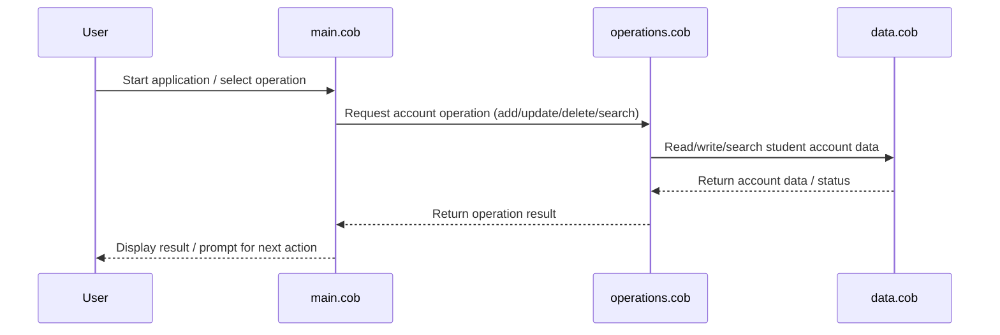

# COBOL Student Accounts System Documentation

This documentation provides an overview of the COBOL source files in the project, describing their purpose, key functions, and business rules related to student accounts.

## File Overview

### `main.cob`
- **Purpose:** Entry point for the COBOL application. Handles program initialization, user interaction, and coordinates calls to other modules.
- **Key Functions:**
  - Program startup and shutdown routines
  - Main menu navigation
  - Delegates operations to `operations.cob` and data management to `data.cob`
- **Business Rules:**
  - Ensures only valid operations are presented to the user
  - Handles error reporting and user prompts

### `operations.cob`
- **Purpose:** Contains core business logic for student account management.
- **Key Functions:**
  - Add, update, and delete student accounts
  - Process account transactions (e.g., payments, adjustments)
  - Validate account data before changes are committed
- **Business Rules:**
  - Enforces unique student IDs
  - Validates transaction amounts and account status
  - Prevents unauthorized modifications

### `data.cob`
- **Purpose:** Manages data storage and retrieval for student accounts.
- **Key Functions:**
  - Read and write student account records
  - Search for accounts by ID or name
  - Persist changes to the underlying data store
- **Business Rules:**
  - Maintains data integrity and consistency
  - Ensures all account changes are properly saved
  - Handles record locking and concurrency where applicable

## Student Account Business Rules
- Each student account must have a unique identifier (student ID).
- Only authorized users can modify account information.
- All transactions must be validated for correctness before being applied.
- Account balances cannot be negative unless explicitly allowed by business policy.
- Changes to account data are logged for audit purposes.

---
For further details, refer to the source code in the `/src/cobol` directory.

---

## Sequence Diagram: Student Accounts Data Flow

